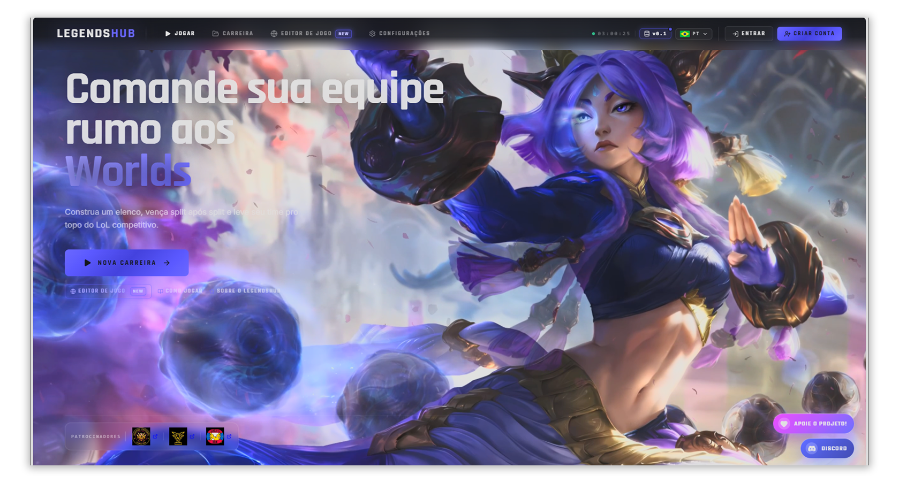

<div align="center">


  <h1 align="center">LegendsHub</h1>

  <p align="center">
    <strong>O LegendsHub é um simulador de gerenciamento (Manager) de eSports de código aberto, criado para ser um jogo completo e imersivo sobre o universo competitivo de League of Legends. Este jogo coloca o usuário no cargo de coach/manager e você terá que lidar com finanças e gestão de pessoas, além de crises, pois o jogo possui um sistema de imprevisibilidade de crimes gerador de forma procedural. Este jogo vai exigir do jogador, criatividade e jogo de cintura para não ser demitido.</strong>
  </p>



  <p align="center">
    <strong>O jogo tem uma interface moderna em Modo Escuro, projetada para oferecer conforto visual, imersão e uma experiência premium para gerenciar sua equipe.</strong>
  </p>


  <p align="center">
    <strong>O jogo tem uma interface moderna em Modo Escuro, projetada para oferecer conforto visual, imersão e uma experiência imersiva do competitivo de League of Legends.</strong>
  </p>

</div>

# 🎮 Características LegendsHub

[](https://react.dev/)
[](https://vite.dev/)
[](https://www.typescriptlang.org/)
[](https://tailwindcss.com/)
[](https://www.electronjs.org/)

O **LegendsHub** é um ecossistema avançado de simulação e gerenciamento tático de equipes de eSports inspirado no competitivo de League of Legends. Projetado para estrategistas, analistas e entusiastas de eSports, ele permite que você assuma o comando operacional de uma organização competitiva profissional, compre pro-players, monte drafts dinâmicos sob as restrições de patches, administre a infraestrutura das Gaming Houses e controle a saúde financeira do seu clube.

Tudo isso envelopado sob os conceitos de um layout inovador — uma estética cyber-HUD inspirada em painéis de jogos modernos, com superfícies translúcidas (Glassmorphism), transições fluidas e contrastes de neon intensos sobre tons profundos e elegantes de azul-escuro-profundo e ardósia.

---

## 🚀 Funcionalidades Principais

*   **🏆 Gerenciamento de Elenco**: Contrate novos jogadores com atributos funcionais de ponta (mecânica, macro, comunicação, consistência, controle emocional, playoff performance, etc.), administre reservas e promova talentos das categorias de base (Academy).
*   **💾 Banco de Dados Local (IndexedDB via localForage)**: Persistência local robusta que funciona inteiramente offline, garantindo que o seu savegame e as modificações do editor (inclusive fotos personalizadas em base64 e logos de times) fiquem salvas em segurança sem perdas.
*   **📊 Estatísticas Avançadas**: Painéis analíticos detalhando a campanha na temporada, estatísticas individuais de atletas (KDA, média de ouro, abates), curvas de receita e despesas financeiras, e a trajetória histórica das rodadas anteriores.
*   **🥇 Simulação Tática de Draft**: Participe da fase cirúrgica de picks e bans de campeões com regras de Tier Lists adaptativas e patches dinâmicos. Encontre a melhor composição para anular as forças dos oponentes.
*   **🏢 Gaming House & Gaming Office**: Invista em upgrades estruturais completos para maximizar a química e o rendimento (computadores profissionais, nutricionistas, psicólogos esportivos, salas de reuniões refinadas, estúdio de criadores de conteúdo e assessores jurídicos).
*   **📰 Press Room & Patrocinadores**: Interaja com entrevistas coletivas de imprensa dinâmicas pós-rodadas, selecione patrocinadores corporativos adequados ao seu nível de popularidade e reaja a notícias e postagens virais de influenciadores e mídias de eSports.
*   **🗺️ Ligas Nacionais e Internacionais**: Participe do calendário oficial de ligas regionais (CBLOL, LCK, LEC, LPL, etc.), suba no torneio de acesso desafiante do Academy, dispute troféus amigáveis da comunidade (como o CBOLÃO) e busque a classificação definitiva rumo ao MSI e ao prestigiado Campeonato Mundial (Worlds).
*   **🛠️ Editor de Conteúdo Embutido**: Customize equipes inteiras, altere acrônimos, cores corporativas, crie novos pro-players ou modifique pro-players existentes (inclusive fazendo upload de fotos personalizadas e logos via base64) para rodar o jogo com a sua fisionomia preferida.
*   **📂 Utilitários de Backup**: Funcionalidade integrada para exportação e importação ágil de saves de slots, possibilitando migrar e testar campanhas de múltiplos universos diferentes de forma rápida.

---

## 💻 Arquitetura e Tecnologias

A aplicação foi projetada sob uma pilha tecnológica moderna e altamente otimizada:

*   **React (v18+)** como motor SPA declarativo baseado em componentes modulares.
*   **Vite** proporcionando ambiente de compilação instantânea e bundling otimizado de produção.
*   **Tailwind CSS** aplicando design líquido com total adaptabilidade para telas escuras e designs densos em desktop.
*   **Motion** para coreografias de micro-animações, hover elásticos e efeitos cinemáticos de menus.
*   **localForage (IndexedDB)** com drivers assíncronos inteligentes para suportar o armazenamento de dados extensos em base64 persistentes em cache persistente local.
*   **Electron** para empacotamento desktop do executável local autossuficiente e portable de alta performance.

---

## Stack

| Tecnologia | Uso |
|---|---|
| React 18 | UI components |
| TypeScript | Type safety |
| Vite 5 | Dev server + bundler |
| Tailwind CSS 3 | Utility-first styling |
| Electron 31 | Desktop app Windows/Linux |
| IndexedDB (idb) | Banco offline |
| Zustand | State global |

---

## Instalação

```bash
npm install
```

> Avisos `deprecated` são normais (vêm do electron-builder). Ignore-os.

---

## Rodar no navegador (mais rápido para desenvolvimento)

```bash
npm run dev
```

Abre em: **http://localhost:5173**

---

## Rodar como app desktop Windows/Linux

### Pré-requisito: baixar o Electron manualmente

O Electron precisa ser baixado separadamente.  
Execute **uma única vez**:

```bash
node -e "require('electron')"
```

Se aparecer o mesmo erro (`Electron failed to install`), execute:

```bash
# Deletar e reinstalar o Electron
rmdir /s /q node_modules\electron
npm install electron --save-dev
```

Depois:

```bash
npm run electron:dev
```

---

## Build para distribuição

### Windows (.exe instalador)

```bash
npm run electron:build
```

Gera em: `release/LegendsHub Setup X.X.X.exe`

### Web (pasta dist/)

```bash
npm run build
```

---

## Vídeo de fundo

Coloque o arquivo do vídeo Yunara em:

```
public/
  videos/
    bg.mp4
```

---

## Estrutura do projeto

```
legendshub/
├── electron/
│   ├── main.ts              # Processo principal Electron
│   └── preload.ts           # Bridge renderer ↔ main
│
├── src/
│   ├── types/index.ts       # Tipos: Player, Team, Champion...
│   ├── db/index.ts          # IndexedDB (10 stores, CRUD, export/import)
│   ├── store/index.ts       # Zustand (auth, settings, modals, saves)
│   ├── lib/i18n.ts          # 7 idiomas: PT EN ES FR DE JA RU
│   │
│   ├── pages/
│   │   └── LauncherPage.tsx
│   │
│   ├── components/
│   │   ├── layout/
│   │   │   └── Navbar.tsx
│   │   ├── ui/
│   │   │   └── Modal.tsx
│   │   └── modals/
│   │       ├── ModalLegalNotice.tsx
│   │       ├── ModalLanguage.tsx
│   │       ├── ModalWelcome.tsx
│   │       ├── ModalNewCareer.tsx
│   │       ├── ModalAuth.tsx
│   │       ├── ModalSettings.tsx
│   │       └── ModalEditor.tsx
│   │
│   ├── App.tsx
│   ├── main.tsx
│   └── index.css
│
├── vite.config.ts           # Config web (npm run dev/build)
├── vite.electron.config.ts  # Config desktop (npm run electron:*)
├── package.json
├── tsconfig.json
├── tailwind.config.js
└── postcss.config.js
```

---

## IndexedDB — Stores

| Store | Conteúdo |
|---|---|
| players | 290+ jogadores reais LCK/LPL/LEC/LCS/CBLOL/LCP |
| teams | 60 times por liga |
| leagues | 6 ligas regionais |
| managers | Head coaches |
| influencers | Criadores de conteúdo |
| press | Veículos de imprensa |
| sponsors | Patrocinadores |
| champions | 172 campeões com tier e patch status |
| saves | Até 6 slots de carreira |
| settings | Configurações do usuário |

---

## Próximos passos

- [ ] Setup de nova carreira (escolha de região e time)
- [ ] Dashboard da carreira (elenco, agenda, finanças)
- [ ] Simulação de partidas
- [ ] Sistema de transferências
- [ ] Modo Online

## 📄 Licença

Este projeto é de uso livre e pessoal para entusiastas de eSports, design corporativo de jogos, táticas e tecnologia.

Desenvolvido com carinho por [Davison Sant](https://github.com/davisonsant). 🚀
